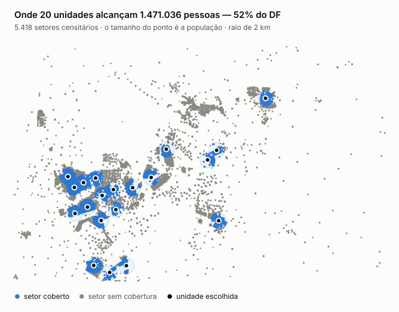
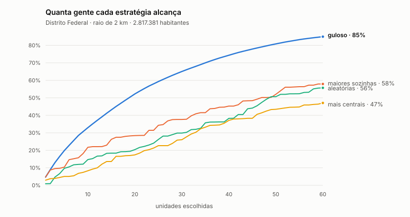
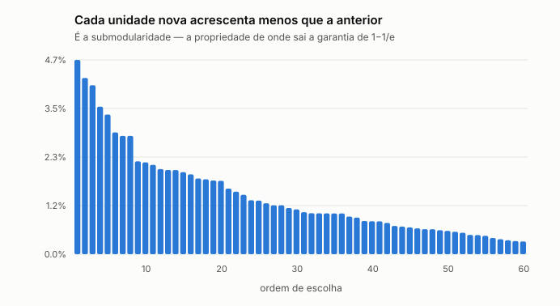

# Cobertura de Saúde no DF

**Número do Grupo:** 31 &nbsp;·&nbsp; **Conteúdo da Disciplina:** Algoritmos Gulosos

Com um orçamento de `k` unidades básicas de saúde, quais escolher para
alcançar o maior número de habitantes do Distrito Federal?

## Alunos

| Matrícula | Aluno |
| --- | --- |
| 222006534 | Anna Clara Cardoso Evangelista Brandão |
| 231026699 | Eduarda Domingos Rodrigues |

## Sobre

O problema é o de **Cobertura Máxima**: dado um conjunto de candidatos, cada um
cobrindo um subconjunto da população, escolher `k` deles que cubram o máximo de
pessoas.

Os dados são reais: **200 unidades de saúde** do CNES e **5.418 setores
censitários** do Censo 2022, somando **2.817.381 habitantes**.

**Por que Cobertura Máxima e não Cobertura de Conjuntos.** O primo mais famoso
do problema, o *set cover*, exige cobrir todo mundo com o mínimo de unidades.
Com dado real ele não tem solução: a um raio de dois quilômetros, as 200
unidades **juntas** alcançam 2.543.256 pessoas, e **274.125 moradores do DF
estão fora do alcance de qualquer uma delas**. Não existe escolha de unidades
que cubra o Distrito Federal inteiro. Cobertura Máxima faz a pergunta que tem
resposta — e que é a pergunta de um gestor com orçamento.



## O algoritmo

A cada passo, escolha a unidade que adiciona mais gente **ainda não coberta**.
É um algoritmo guloso, e carrega uma garantia demonstrada: sempre atinge pelo
menos **1 − 1/e ≈ 63,2%** do ótimo, para qualquer instância.

### Por que "ainda não coberta" é a palavra que importa

A tentação é escolher as unidades que cobrem mais gente **sozinhas**. Isso
ignora que duas unidades vizinhas atendem **as mesmas** pessoas: a segunda
parece valer 100 mil habitantes e, somada à primeira, acrescenta quase nada. O
guloso olha o **ganho marginal** — quantos habitantes entram que ainda não
estavam na conta — e é só nisso que ele difere da escolha ingênua. A seção
[Validação](#validação) mede essa diferença: com vinte unidades, 52,2% contra
28,4%.

### O laço, em `src/guloso.py`

São `k` rodadas. Em cada uma, percorre as unidades ainda não escolhidas,
calcula quantos habitantes novos cada uma traria, e fica com a melhor. Empate
vai para o menor índice, o que torna o resultado reproduzível.

A função `historico` devolve a trilha inteira — a unidade escolhida em cada
rodada, o ganho daquela rodada, o acumulado e quais setores entraram. É dela
que saem o gráfico do ganho marginal e as curvas de cobertura; `guloso` é só a
lista de unidades, e `populacao_coberta` o número final.

**Custo:** `k` rodadas × `n` unidades × os setores que cada uma alcança — com
`n` igual a 200 e mediana de 71 setores por unidade, são 0,02 s para `k = 20` e
0,04 s para `k = 60`.

### A garantia, e de onde ela vem

Cada unidade nova acrescenta menos que a anterior, porque o que ela cobre já
vai estando coberto. Essa propriedade chama-se **submodularidade**, e é dela
que Nemhauser, Wolsey e Fisher tiraram, em 1978, o limite de 1 − 1/e para o
guloso em cobertura máxima. O gráfico do ganho marginal, na seção de validação,
é essa propriedade desenhada.

A garantia é um **piso para o pior caso imaginável**, não uma previsão. Nas
instâncias reais deste trabalho o guloso ficou em 99,95% do ótimo.

### A força bruta, em `src/exato.py`

Para saber a que distância do ótimo o guloso está, é preciso conhecer o ótimo.
O `exato` testa **todas** as combinações de `k` unidades entre `n` e fica com a
melhor — resposta certa por construção, e por isso a régua.

Ele testa combinações de tamanho exatamente `k`, e não "até `k`": como nenhuma
população é negativa, acrescentar unidade nunca piora a cobertura, então
alguma solução ótima de tamanho `k` sempre existe.

**O preço é o fatorial.** São C(`n`, `k`) combinações. Com as 200 unidades:

| `k` | combinações | tempo |
| --- | --- | --- |
| 2 | 19.900 | 0,14 s |
| 3 | 1.313.400 | 14 s |
| 8 | 55.098.996.177.225 | cerca de 18 anos |

É por isso que a comparação com o ótimo roda em instâncias reduzidas, com 20 a
30 candidatos, e é por isso que o guloso existe.

## Os dados

Nenhum dos dois arquivos é versionado — são grandes e públicos. Baixe os dois
abaixo em `data/raw/` antes de rodar o projeto. Rodar `python -m src.dados` sem
eles imprime os mesmos links.

### Unidades de saúde — CNES, Ministério da Saúde

<https://dadosabertos.saude.gov.br/dataset/unidades-basicas-de-saude-ubs>

Baixe o CSV e salve como `data/raw/Unidades_Basicas_Saude-UBS.csv`.

| | |
| --- | --- |
| Registros no Brasil | 47.983 |
| No Distrito Federal | 212 |
| **Com coordenada válida** | **200** |
| Códigos CNES repetidos | 0 |

Duas armadilhas, as duas com teste próprio em `tests/test_dados.py`:

- **A latitude vem com ponto decimal e a longitude com vírgula.** Não é um caso
  isolado da linha, é o arquivo nacional inteiro. Sem trocar a vírgula por
  ponto, todo `float()` de longitude estoura.
- **A base mistura tipos de estabelecimento.** Das doze sem coordenada, só duas
  parecem unidade básica de saúde de verdade; as outras dez são clínicas
  particulares, uma fisioterapia, uma casa de apoio. Mantivemos a base como ela
  vem, sem filtrar por tipo, e registramos a decisão aqui — filtrar exigiria um
  critério que o próprio arquivo não oferece.

### População — Censo 2022, IBGE

<https://ftp.ibge.gov.br/Censos/Censo_Demografico_2022/Agregados_por_Setores_Censitarios/malha_com_atributos/setores/shp/UF/DF/DF_setores_CD2022.zip>

**Descompacte o arquivo**, deixando os cinco arquivos (`.shp`, `.dbf`, `.shx`,
`.prj`, `.cpg`) soltos em `data/raw/`. São só 2,5 MB: é o arquivo do DF, não o
nacional. O `.dbf` já traz os 36 atributos junto da geometria, então **não é
preciso baixar o CSV nacional de 102 MB** — a população sai do próprio
shapefile.

| | |
| --- | --- |
| Setores censitários no DF | **5.418** |
| População | **2.817.381** |
| Urbanos / rurais | 5.021 / 397 |
| Sem população | 76 |
| Regiões administrativas | 33 |

Confirmamos que a coluna `v0001` é mesmo a população residente somando-a no país
inteiro: **203.080.756**, que é exatamente o resultado do Censo 2022.

**Sem biblioteca de GIS.** O shapefile do IBGE está em SIRGAS 2000 geográfico —
ou seja, já em latitude e longitude, sem reprojeção a fazer. Lemos com o `pyshp`,
que é um módulo único em Python puro, e calculamos o centro de cada setor com a
fórmula do shoelace, em `src/geometria.py`. Os 5.418 centroides saem em cerca de
meio segundo.

**O que isso aproxima.** O centro geométrico de um setor não é onde as pessoas
dele moram. Num setor urbano, de poucos quarteirões, a diferença é pequena. Num
setor rural grande o centro pode cair no meio do nada. É a aproximação que o
trabalho assume, e ela empurra o resultado para baixo, não para cima: setor
rural tem pouca gente e quase nunca entra na conta do guloso.

## Validação

Um algoritmo guloso rodando não prova que ele valeu a pena. São três perguntas
diferentes, e `validacao.py` responde as três.

### 1. Ele ganha das escolhas óbvias?

A comparação é contra o que alguém faria sem algoritmo nenhum: pegar as unidades
que **sozinhas** cobrem mais gente, pegar as mais perto do centro populacional,
ou sortear.



| unidades | **guloso** | maiores sozinhas | aleatórias | mais centrais |
| --- | --- | --- | --- | --- |
| 5 | **19,9%** | 10,4% | 9,7% | 5,1% |
| 10 | **32,9%** | 21,7% | 14,7% | 8,3% |
| 20 | **52,2%** | 28,4% | 20,4% | 17,4% |
| 40 | **74,4%** | 45,3% | 38,3% | 37,1% |
| 60 | **85,0%** | 57,9% | 55,7% | 47,1% |

Com vinte unidades o guloso cobre **1,84 vez** o que a melhor dessas escolhas
alcança. A coluna das aleatórias é um sorteio de semente fixa; na média de
trinta sorteios ela fica em 25,0%, o que não muda a conclusão.

A linha interessante é a das **maiores sozinhas**, porque é a escolha que parece
certa e não é. Ela ignora que duas unidades vizinhas cobrem **as mesmas**
pessoas. O guloso olha o ganho marginal, não o tamanho absoluto, e essa é a
única diferença entre as duas.

### 2. Quão longe ele fica do ótimo?

Na instância completa não dá para saber: com 200 unidades, `k = 3` já são
1.313.400 combinações e cerca de catorze segundos, e `k = 8` seriam
55.098.996.177.225 combinações — no mesmo ritmo, cerca de dezoito anos.

Então comparamos em **doze instâncias reduzidas**, com 20 a 30 candidatos e `k`
de 2 a 4, onde a força bruta de `src/exato.py` termina.

| | |
| --- | --- |
| Encontrou o ótimo | **11 de 12** |
| Pior caso | **99,35%** do ótimo |
| Média | **99,95%** |
| Garantia teórica | 63,21% |

### 3. O ganho de cada unidade nova diminui?



Diminui, e sempre. Essa é a **submodularidade** — a propriedade de onde sai a
garantia de 1 − 1/e. A primeira unidade escolhida cobre um bairro inteiro; a
sexagésima cobre o que sobrou.

## Achados

**O guloso é muito melhor do que a garantia promete.** A teoria assegura 63,21%
do ótimo; na prática ele acertou o ótimo em onze de doze instâncias e no pior
caso ficou a 99,35%. A garantia é um piso para o pior caso imaginável, não uma
previsão — e o buraco entre os dois é o achado principal do trabalho.

**Com 20% das unidades, três quartos da população.** Quarenta das 200 unidades
cobrem 74,4% do Distrito Federal.

**O guloso não distribui, ele concentra.** Vale olhar os três mapas em sequência
— `validacao_raio2_mapa_k5.svg`, `_k20.svg` e `_k60.svg`. Com cinco unidades,
todas as cinco vão para Ceilândia e Taguatinga. Com vinte ele já saiu para
Sobradinho, Gama e Planaltina, porque os vizinhos de Ceilândia já estão cobertos
e não somam mais nada. Com sessenta, quase toda a mancha urbana está coberta e
sobra o polvilhado rural.

**O raio é decisão nossa, não dado.** Não existe "o raio certo" de uma unidade
básica de saúde. A resposta honesta é mostrar que a escolha muda o resultado:

| unidades | raio 1 km | raio 2 km | raio 3 km |
| --- | --- | --- | --- |
| 20 | 22,4% | 52,2% | 75,2% |
| 40 | 37,2% | 74,4% | 90,2% |
| todas as 200 | 62,8% | 90,3% | 95,3% |

## Extensão: Mochila (orçamento em R$)

O guloso principal usa um orçamento em número de unidades — todas "custam" 1.
Isso não é realista: abrir ou manter uma UBS tem custo variável (porte, equipe,
infraestrutura). O `src/mochila.py` troca a contagem por um orçamento em reais,
o que transforma o problema em Mochila 0/1 clássica.

Entre os problemas gulosos vistos na disciplina (Interval Scheduling, Interval
Partitioning, Minimize Lateness, Knapsack, Troco de moedas, roteamento tipo
caixeiro-viajante, Huffman), Mochila foi o único com encaixe honesto: os outros
exigiriam inventar uma dimensão de tempo, denominação monetária ou rota que os
dados não têm — o mesmo motivo pelo qual a AGM ficou fora do T1 deste grupo.

Três decisões, ditas com todas as letras:

- **Custo simulado, não real.** O CNES não publica custo de manutenção por
  unidade. O `custo_simulado()` gera um valor determinístico (semente fixa),
  proporcional ao número de setores que a unidade alcança — documentado como
  ilustrativo, nunca confundido com o resto do projeto, que é todo dado real.

- **"Valor" é outra métrica, de propósito.** Mochila de livro-texto exige
  valores fixos e independentes por item; a população coberta com raio se
  sobrepõe entre unidades (o mesmo motivo de o guloso principal olhar ganho
  marginal), então não serve aqui. Usamos a população do setor censitário mais
  próximo de cada unidade — uma pergunta diferente ("que unidades priorizar
  olhando só o entorno imediato"), não uma Cobertura Máxima disfarçada de
  Mochila.

- **A garantia é mais fraca, e isso é o ponto de comparação.** Guloso por razão
  valor/custo, sozinho, não tem garantia nenhuma — um item caro e valioso pode
  ficar de fora mesmo valendo mais que vários itens baratos somados. Com a
  correção clássica (comparar com o melhor item isolado que cabe no orçamento e
  ficar com o maior dos dois), a garantia sobe para pelo menos **1/2 do ótimo**
  — mais fraca que o 1 − 1/e da Cobertura Máxima, porque falta a
  submodularidade que sustenta aquela garantia.

Validado contra a instância clássica de livro-texto e contra a programação
dinâmica exata em 30 instâncias sintéticas aleatórias, em
`tests/test_mochila.py`.

## Instalação

Requer **Python 3.10 ou mais novo**. Os comandos rodam da raiz do repositório.

```bash
python -m venv .venv
source .venv/bin/activate          # Windows: .venv\Scripts\Activate.ps1
pip install -r requirements.txt
```

Depois baixe os dados conforme a seção **Os dados** acima.

## Uso

A interface, com controles de raio e de `k`:

```bash
streamlit run app.py
```

Os módulos também rodam sozinhos pela linha de comando:

```bash
python -m src.dados                 # confere o carregamento das duas bases
python -m src.cobertura 2           # quem cobre quem, a um raio de 2 km
python -m src.guloso 20 2           # o algoritmo: 20 unidades, raio de 2 km
python -m src.exato 3 2             # a força bruta (só para k pequeno)
python -m src.linhas_base 20        # as escolhas óbvias, para comparar
python -m src.mochila 300000 2      # a extensão: orçamento de R$ 300 mil
```

A validação completa gera os três gráficos, a tabela e os dados brutos em
`resultados/`:

```bash
python validacao.py                 # leva uns quatro segundos
python validacao.py --raio 3 --kmax 80
```

A rodada completa gasta quase todo o tempo na força bruta. Para só redesenhar o
mapa, com outro `k` ou outro raio, em cerca de um segundo:

```bash
python validacao.py --so-mapa --kmapa 20
```

## Testes

```bash
python -m unittest discover
```

São 111 testes. Os que dependem dos arquivos brutos são pulados quando eles não
estão em `data/raw/`, então a suíte roda num clone recém-feito, sem download.

## Apresentação

`<link do vídeo>`

## Referências

- NEMHAUSER, G.; WOLSEY, L.; FISHER, M. *An analysis of approximations for
  maximizing submodular set functions*. Mathematical Programming, 1978.
- CORMEN, T. H. et al. *Introduction to Algorithms*. 3. ed.
- [Unidades Básicas de Saúde — Portal de Dados Abertos do SUS](https://dadosabertos.saude.gov.br/dataset/unidades-basicas-de-saude-ubs)
- [Censo 2022, agregados por setores censitários — IBGE](https://ftp.ibge.gov.br/Censos/Censo_Demografico_2022/Agregados_por_Setores_Censitarios/)
